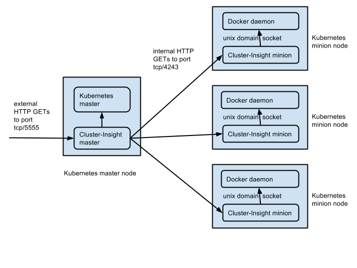

# Cluster Insight: a context graph generator for Kubernetes clusters

Cluster Insight (cluster-insight) is a Kubernetes service that collects runtime metadata about resources in a Kubernetes cluster, and infers relationships between them to create a *context graph*.

A context graph is a point-in-time snapshot of the cluster’s state. Clients of the cluster-insight service, such as UIs, can retrieve context graphs through the service's REST API. Each call may produce a different context graph, reflecting the inherent dynamicity in the Kubernetes cluster. 

A context graph provides contextual information that can be combined with resource level monitoring data to enable visual navigation of the dynamic state of a Kubernetes cluster.

The nodes of the context graph are cluster resources (e.g. nodes, pods, services, replication-controllers, containers, processes, and images), and the edges are the inferred relationships (e.g. contains, runs, monitors, loadBalances, createdFrom).

## How to install and access the service

The cluster-insight service uses a Docker container, available [here](https://registry.hub.docker.com/u/kubernetes/cluster-insight/) on Docker Hub.
The container runs in one of two modes, specified by an environment variable:

* In "master" mode, it collects data from Kubernetes and from the Docker daemons running on the cluster nodes through proxies. 
* In "minion" mode, it acts as a proxy for the local Docker daemon.

An instance of the container in "master" mode should run on at least one node in the cluster, and an instance in "minion" mode should run on every node.

The cluster-insight service does not require any changes to the cluster, and should run correctly on any valid  cluster without modification. Note, however, that it has only been tested on GCE clusters running Debian GNU/Linux 7 (wheezy) and vagrant clusters running Ubuntu 14.04.

The provided installation script will configure, install, and run cluster-insight. You should be able to run it on any Linux or MacOSX machine. Note, however, that it has only been tested on Ubuntu 14.04 and MacOSX Yosemite.

### Kubernetes API version

The cluster-insight service currently supports only Kubernetes API version "v1".
To check which API versions are supported by your cluster, run the following command on the master node of your cluster:
```
$ kubectl api-versions
```
The output should look like:
```
Available Server Api Versions: v1beta3,v1
```
If API version "v1" is not supported on your cluster, you have to upgrate your Kubernetes installation before you can install and use
Cluster-Insight.

### Easy installation: run the provided installation script

The provided installation script, `cluster-insight-setup.sh`, will install and run the service on a cluster.
You can run it as often as you like to update the service (e.g., when the container image in Docker Hub or any of the configuration files in the
`./cluster-insight/install` directory have changed).
The script pulls the latest released version of the image from Docker Hub only if it does not exist yet in the nodes of your cluster.
To run the script:

* Clone the cluster-insight sources from Github into a local directory named `./cluster-insight` on the master node of your cluster
using a command like `git clone https://github.com/google/cluster-insight.git`.
If you do not have a master node (for example, you run on GKE), clone the sources into a directory on your workstation.
* Run the installation script from the local directory on the master node of your cluster (or from a local directory on your workstation
when running on GKE) using a command like
`./cluster-insight/install/cluster-insight-setup.sh [<path/to/kubernetes>]`, where the optional `<path/to/kubernetes>` is the path to
your kubernetes binary directory.

The installation script starts the cluster-insight service and two replication controllers, one for the master and one for the minions.
By default, the master replication controller runs one replica, and the minion replication controller runs a replica for every node in the cluster.
Both replications controllers pull the latest released version of the cluster-insight container image from Docker Hub when necessary.

### Behind the scenes: released image tags

The Cluster-Insight images on Docker Hub are tagged by the date they were built. For example, the tag is `2015-07-01` for the image built on
July 1st, 2015.
The template files in `./cluster-insight/install/cluster-insight-{master,minion}-controller.yaml` mention the latest released image by its tag.
We will update the image tag in these template files whenever we push a new released image to Docker Hub.

### For experts only: run the Cluster-Insight in debug mode

The provided installation script, `cluster-insight-setup.sh`, can also install the latest `kubernetes/cluster-insight` image in each node
(as opposed to the latest released version from Docker Hub), and run then in debug mode.
To install and run the latest image you should:
* On every node of your cluster (master and minion nodes) you should clone the cluster-insight sources from Github into a local directory named
`./cluster-insight` using a command like `git clone https://github.com/google/cluster-insight.git`.
* On every minion node of your cluster you should build the Cluster-Insight image.
You should follow the instructions in the `./cluster-insight/collector/Dockerfile` to build the image.
* On the master node of your cluster or on your workstation in case you do not have a master node (for example, when you run on GKE)
you should run the installation script from the local directory using a command like
`./cluster-insight/install/cluster-insight-setup.sh -d [<path/to/kubernetes>]`, where the optional `<path/to/kubernetes>` is the path to
your kubernetes binary directory.

Running the Cluster-Insight in debug mode enables extensive logging (good), but also enables the built-in debugger that allows any client
to access the internals of the running cluster-insight master after a failure (a security hole).
You should install and run the Cluster-Insight service in debug mode only if you develop new code or need more detailed logging information.
In any case, do not run Cluster-Insight in debug mode while serving external traffic. 

### Easy access: use the REST API

To access the service, use the REST API described below, which is exposed at the service endpoint. There are multiple ways to reach a service endpoint in Kubernetes, and any of them can be used to access cluster-insight, since it is just an ordinary Kubernetes service. Here are two common scenarios to help you get started:

#### Using kubectl proxy and the proxy verb

To access cluster-insight using kubectl proxy and the proxy verb:

* Run kubectl proxy to expose the cluster on a local port, as described 
[here](https://github.com/GoogleCloudPlatform/kubernetes/blob/master/docs/kubectl_proxy.md). 
* Assuming that you exposed the cluster on local port 8001 and that you're using API version v1, you should be able to find the cluster-insight service at `http://localhost:8001/api/v1/namespaces/default/services/cluster-insight`.
* With the same assumptions, you should be able to access the service through the api-server using the proxy verb, at `http://localhost:8001/api/v1/proxy/namespaces/default/services/cluster-insight:cluster-insight/`.

#### Using a load balancer

To access cluster-insight using a load balancer, set the service type to LoadBalancer in `./cluster-insight/install/cluster-insight-service.yaml`, as described [here](https://github.com/GoogleCloudPlatform/kubernetes/blob/master/docs/services.md#type--loadbalancer), and run the installation script. Depending on the platform, you may also have to create a firewall rule to allow HTTP access to the load balancer on the service port, which defaults to 5555.

## Data collection details

In "master" mode, the cluster-insight container listens for HTTP requests on local port 5555, as shown in the figure below. In "minion" mode, it listens on local port 4243, and relays requests to the local Docker daemon via the default Unix-domain socket, as described [here](https://docs.docker.com/articles/basics/).



## REST API

These are the APIs that clients can use to get context graphs and raw resource metadata:

* `/cluster` returns a context graph. The format of the context graph is described below.
* `/cluster/resources/TYPE` returns the raw metadata for all cluster resources of type TYPE, where TYPE is one of { Node, Pod, Service, ReplicationController, Container, Image, Process }.
* `/debug` returns a rendering of the current context graph in DOT format for debugging purposes.
* `/version` returns the name of the currently running cluster-insight Docker image, its identifier, and its compilation date.

In order to minimize overhead on the target cluster, the context graph is computed on demand from cached metadata describing the cluster resources. The cache is internal to the Cluster Insight service. Its update frequency is fixed in this release at once every 10 seconds. In a future release, the cache may update automatically in response to Kubernetes API events, ensuring that the resource data is always up to date.

## Context graph format

The context graph is a JSON document with the following format:

```js
{
  "timestamp": SNAPSHOT-TIME,
  "resources" : [
    {
      "id" : RESOURCE-ID,
      "type" : RESOURCE-TYPE,
      "timestamp" : WHEN-OBSERVED,
      "properties" : RESOURCE-METADATA,
      "annotations" : {
        "label" : RESOURCE-LABEL
      }
    },
    ...
  ],
  "relations" : [
    {
      "type" : RELATION-TYPE,
      "timestamp" : WHEN-INFERRED,
      "source" : RESOURCE-ID,
      "target" : RESOURCE-ID,
      "annotations" : {
        "label" : RELATION-LABEL
      }
    },
    ...
  ]
}
```

The `properties` field in `resources` is the observed runtime data for the corresponding resource that was collected from the Kubernetes master or from the Docker daemons on the minion nodes. The `annotations` field in `resources` and `relations` contains key-value pairs inserted by the Cluster Insight logic.

Resources and relations have a `timestamp` attribute, indicating when they were first observed or inferred, respectively. The `timestamp` value should remain constant as long as the corresponding resource or relation did not change substantially.

When comparing resource values, we compute the hash of the JSON representation after removing the attributes `timestamp`, `lastHeartbeatTime` and `resourceVersion`, because their values are ephemeral and do not indicate a substantial change in the corresponding resource. All data older than 1 hour is deleted automatically from the cache. The value of the `timestamp` attribute will therefore remain constant for at most one hour.

The entire context graph has a separate timestamp, which is the maximum of the timestamps of the resources and relations contained in the graph. If the timestamp of the entire context graph did not change, then there was
no substantial change in any of the resources and relations inside it.
