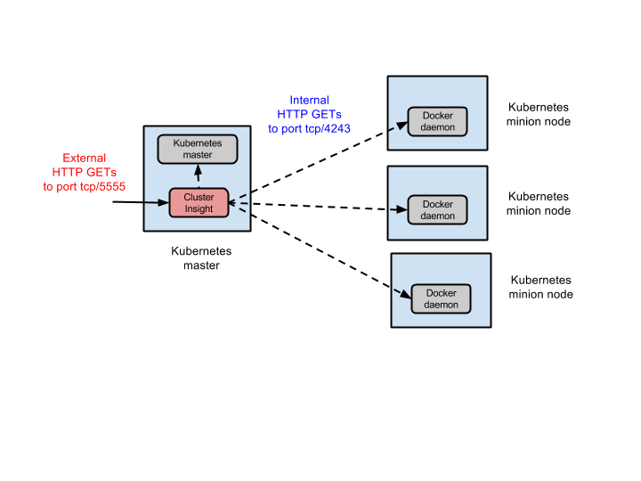

# Cluster Insight: a context graph generator for Kubernetes clusters

Cluster Insight is a user-installable service that collects runtime metadata
about resources in a Kubernetes managed cluster, and infers relationships
between those resources to create a *context graph*. The nodes of the context
graph are cluster resources (e.g. nodes, pods, services,
replication-controllers, containers, processes, and images), and the edges are
inferred relationships between those resources (e.g. memberOf, monitors,
loadBalances, createdFrom).

The context graph represents a point-in-time snapshot of the cluster’s state.
Subsequent snapshots may produce different context graphs, reflecting the
inherent dynamicity in the Kubernetes cluster.

Clients of the Cluster-Insight service, such as UIs, can retrieve context graph
snapshots through a REST API. The context graph provides valuable contextual
data that can be combined with resource level monitoring data to enable
enhanced visual navigation of the dynamic state of a Kubernetes cluster.


## How to install and activate this service

The Cluster Insight service expects to run on the Kubernetes master node, and
can be deployed from a self-contained Docker image, built offline from the
source code.

To build a Docker image from the source code, follow these instructions:

* Install and start the Docker service on the machine, if it not already present.
* Pull the cluster-insight sources from Github into a local directory
  ./cluster-insight
* Change directory to ./cluster-insight
* Run: `sudo docker build -t google/cluster-insight . `
* Check for the image: `sudo docker images`. You should see an image named
  google/cluster-insight.

To install and activate this service, follow these instructions:

* On each of the Kubernetes minion nodes the following:
   * Login to the minion host.
   * Edit the file /etc/default/docker, and replace the line `DOCKER_OPTS=`
     with the line: `DOCKER_OPTS='-H tcp://0.0.0.0:4243 -H unix:///var/run/docker.sock'`
   * Restart the Docker daemon: `sudo service docker restart`

* On the Kubernetes master do the following:
   * Login to the master host.
   * Check if the Docker service is running: `sudo docker ps`. If this gives
     an error, you must install and start the Docker service on this machine.
   * Download the Docker image google/cluster-insight:
       * If you want to use a pre-built image, use `sudo docker pull google/cluster-insight`
         to download it from Docker Hub.
       * If you want to use the image you created from sources using the build
         instructions above, then copy that google/cluster-insight image into
         this machine.

   * Start the cluster-insight service like this:
     `sudo docker run -d --net=host -p 5555:5555 --name cluster-insight google/cluster-insight`.
   * The Cluster-Insight service should now be listening for REST
     API requests on port 5555 in the Kubernetes master. Check this by typing:
     `sudo docker ps` - you should see a running container with the name
     cluster-insight.

* If you plan to access this service externally over HTTP, you must create a
  firewall rule on your platform to enable HTTP access to port 5555 on the
  Kubernetes master host.
   * On the Google Cloud Platform, you can do this using the gcloud command
     line tool: `gcloud compute firewall-rules create FIREWALL_RULE_NAME --allow tcp:5555 --network "default" --source-ranges "0.0.0.0/0" --target-tags KUBERNETES_MASTER_NAME`


## Data collection details

The Cluster Insight service runs on the Kubernetes master node, and accesses
the Docker daemons on all of the minion nodes via port 4243 on each minion node.
In addition, it listens for external HTTP requests to its REST endpoint on port
5555 of the master node, as shown in the figure below:




## REST API

These are the APIs that clients of Cluster Insight can use to get the context
graph snapshot, and raw resource-specific metadata:

* `/cluster` - returns a context graph snapshot, with a timestamp. The context
  graph is a JSON document consisting of “resources” and “relation” keys. The
  format of this JSON document is described later.
* `/cluster/resources/TYPE` - returns the raw metadata for cluster resources
  of type TYPE, where TYPE must be one of {Node, Pod, Service,
  ReplicationController, Container, Image, Process}.
* `/debug` - returns a rendering of the context graph in DOT format for
  debugging purposes.

In order to minimize monitoring overhead on the Kubernetes cluster, the context
graph is computed from cached metadata about the cluster resources. The cache
is internal to the Cluster Insight service, and its update frequency is fixed
in this release. In a future release, the cache will update automatically in
response to Kubernetes API events, ensuring that the resource data is always
up to date. The context graph is computed on demand using the resource metadata
from the cache.

## Context graph format

The context graph is a JSON document with the following format:
```js
{
  "timestamp": SNAPSHOT-TIME,
  "resources" : [
    {
      "id" : RESOURCE-ID,
      "type" : RESOURCE-TYPE,
      "timestamp" : WHEN-OBSERVED,
      "properties" : RESOURCE-METADATA,
      "annotations" : {
        "label" : RESOURCE-LABEL
      }
    },
    ...
  ],
  "relations" : [
    {
      "type" : RELATION-TYPE,
      "timestamp" : WHEN-INFERRED,
      "source" : RESOURCE-ID,
      "target" : RESOURCE-ID,
      "annotations" : {
        "label" : RELATION-LABEL
      }
    },
    ...
  ]
}
```

The properties field is the observed runtime metadata for a resource that was
collected from the Kubernetes master and the Docker daemons on its minion nodes.
The annotations field contains key-value pairs inserted by the cluster-insight
logic.

Each of the resources and relations has a timestamp field, indicating when
it was observed or inferred respectively. The entire context graph has a
separate timestamp indiciating when the graph was computed from the resource
metadata.

